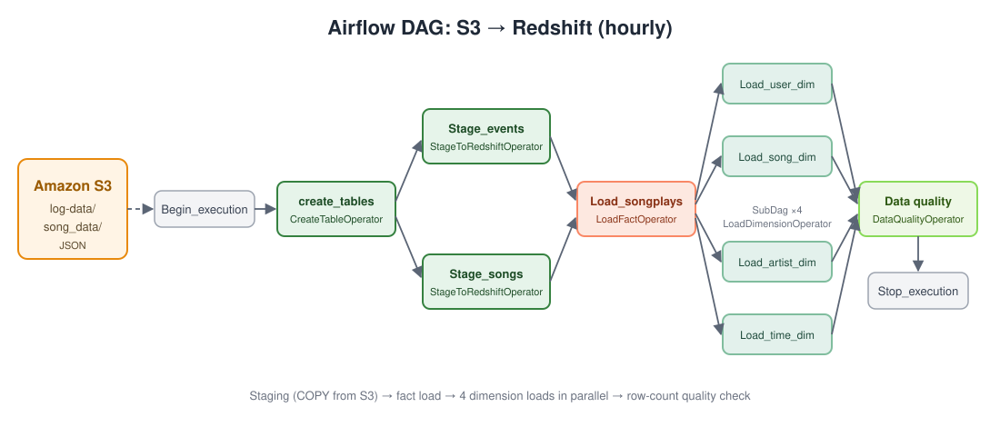
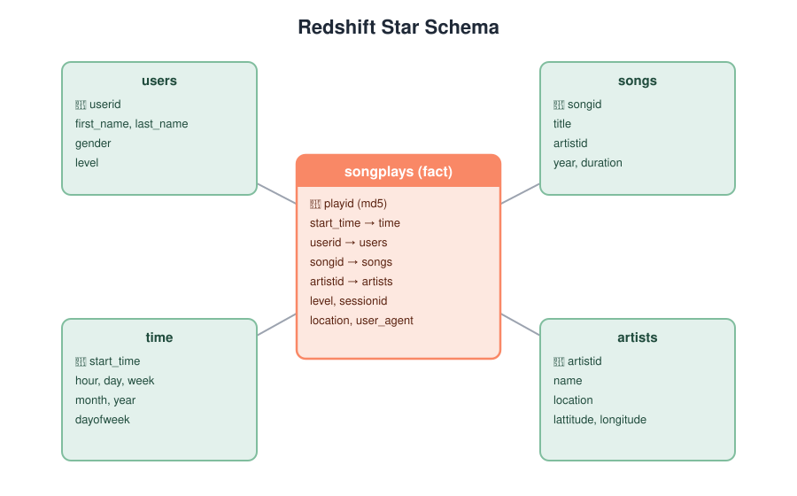
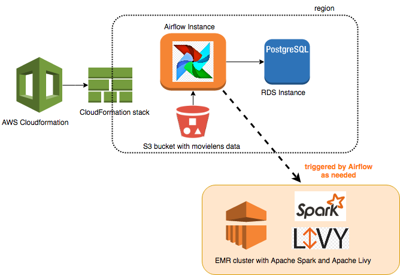

# Airflow → Redshift Data Pipeline

An hourly, automated ETL pipeline built with **Apache Airflow** that loads JSON event and song data from **Amazon S3** into a **star schema on Amazon Redshift**, using custom reusable operators and automated data quality checks.



## Tech Stack

`Apache Airflow 1.10` · `Amazon Redshift` · `Amazon S3` · `Python` · `SQL` · `Docker` · `AWS CloudFormation`

## What it does

A music streaming startup ("Sparkify") stores user activity logs and song metadata as JSON in S3. This pipeline:

1. **Creates** the staging, fact and dimension tables in Redshift (idempotent `CREATE TABLE IF NOT EXISTS`).
2. **Stages** raw JSON from S3 into Redshift in parallel with `COPY` (events use a JSONPaths file; songs use `auto`).
3. **Loads** the `songplays` fact table by joining events to songs.
4. **Loads** four dimension tables (`users`, `songs`, `artists`, `time`) in parallel via SubDAGs, with optional truncate-and-load.
5. **Validates** every final table with a data quality check that fails the run if a table is empty.

## Data Model



## Custom Operators

| Operator | File | Purpose |
|---|---|---|
| `CreateTableOperator` | `plugins/operators/create_table.py` | Runs `plugins/helpers/create_tables.sql` to create all tables |
| `StageToRedshiftOperator` | `plugins/operators/stage_redshift.py` | Templated `COPY` from any S3 prefix into a staging table, JSONPaths or `auto` |
| `LoadFactOperator` | `plugins/operators/load_fact.py` | Append-only load into the fact table |
| `LoadDimensionOperator` | `plugins/operators/load_dimension.py` | Dimension load with optional `DELETE` (truncate-insert) mode |
| `DataQualityOperator` | `plugins/operators/data_quality.py` | Row-count validation across a list of tables; raises on failure |

## Project Structure

```
.
├── dags/
│   ├── udac_example_dag.py          # Main DAG: task wiring & schedule
│   └── sparkify_dimension_subdag.py # SubDAG factory for dimension loads
├── plugins/
│   ├── operators/                   # 5 custom operators
│   └── helpers/
│       ├── sql_queries.py           # INSERT ... SELECT transforms
│       └── create_tables.sql        # Redshift DDL
├── data/                            # Sample dataset to upload to S3
│   ├── log-data/
│   ├── song_data/
│   └── log_json_path.json
├── docs/images/                     # Diagrams
├── docker-compose.yml               # Local Airflow for testing
├── Airflow_CloudFormation.yaml      # Optional: Airflow on EC2 + RDS
├── Airflow_Livy_Setup_CloudFormation.md
└── Setup_Redshift_Connection_Airflow.md
```

## DAG Configuration

- Schedule: hourly (`0 * * * *`)
- `depends_on_past=True`, `max_active_runs=1`
- Retries: 1, with a 5-minute delay
- No email on retry

---

## Running Locally

### Prerequisites
- [Docker Desktop](https://www.docker.com/products/docker-desktop/)
- An AWS account, an S3 bucket and a Redshift cluster or Serverless workgroup **in the same region**

### 1. Upload the sample data to S3
```bash
aws s3 sync data/ s3://<your-bucket>/ --exclude "*.DS_Store"
```
The bucket should contain `log-data/`, `song_data/` and `log_json_path.json` at its root.

### 2. Start Redshift
Create a **Redshift Serverless** workgroup (or a small provisioned cluster). Turn on **Publicly accessible**, and add an inbound rule for port `5439` from your IP to its security group.

### 3. Start Airflow
```bash
cp .env.example .env        # then set S3_BUCKET=<your-bucket>
docker compose up -d
```
Open http://localhost:8080.

### 4. Add connections
Follow [Setup_Redshift_Connection_Airflow.md](Setup_Redshift_Connection_Airflow.md) to add the `aws_credentials` and `redshift` connections.

### 5. Run it
Turn the `udac_example_dag` toggle **On**, then click **Trigger DAG**. Every task should go green. To verify, run this in the Redshift query editor:
```sql
SELECT COUNT(*) FROM songplays;
SELECT * FROM users LIMIT 5;
```

### 6. Clean up
```bash
docker compose down
```
Delete the Redshift workgroup or cluster when you're done to avoid charges.

## Deploying on AWS (optional)

`Airflow_CloudFormation.yaml` provisions Airflow on EC2 with a Postgres RDS metadata DB. See [Airflow_Livy_Setup_CloudFormation.md](Airflow_Livy_Setup_CloudFormation.md).


